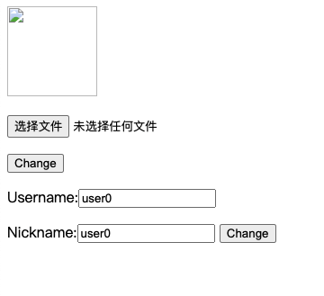
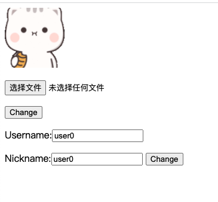

# 用户管理系统

## 设计简介

此项目主要包含三个部分

* 用户 Web 登陆界面
* HTTP server 服务
* TCP server 服务

使用的数据库：Redis（热点数据缓存）和 MySQL。

### HTTP Server

负责处理 HTTP 请求，对用户数据进行简单处理并转发至 TCP 服务。

### TCP Server

处理 HTTP 服务转发的请求并访问 MySQL 和 Redis。

> HTTP server 和 TCP server 之间的通信是通过 RPC 调用。

### RPC 通信协议实现

* RPC 客户端：通过 TCP 连接 RPC 服务器，发送不同的数据信息，从而调用不同的 RPC 服务。

* RPC 服务端：首先注册一些服务（本质服务对应的服务处理函数），监听请求。 当收到 RPC 客户端数据时，解析信息调用对应的服务并且将处理完成的结果返回给客户端。


## 服务流程图

// TODO 补充时序图

## API 接口

### 注册

| URL     | 方法 |
| ------- | ---- |
| /signup | POST |

输入参数

| 参数名   | 描述   |
| -------- | ------ |
| username | 用户名 |
| password | 密码   |

### 登录

| URL    | 方法 |
| ------ | ---- |
| /login | POST |

输入参数

| 参数名   | 描述   |
| -------- | ------ |
| username | 用户名 |
| password | 密码   |

### 获取用户信息

>需要在登录接口之后调用

| URL      | 方法 |
| -------- | ---- |
| /profile | GET  |

输入参数

| 参数名   | 描述   |
| -------- | ------ |
| username | 用户名 |

### 更改用户昵称

> 需要在登录接口之后调用

| URL             | 方法 |
| --------------- | ---- |
| /updatenickname | POST |

输入参数

| 参数名   | 描述   |
| -------- | ------ |
| username | 用户名 |
| nickname | 新昵称 |

### 更改用户头像

> 需要在登录接口之后调用

| URL         | 方法 |
| ----------- | ---- |
| /uploadfile | POST |

输入参数

| 参数名   | 描述         |
| -------- | ------------ |
| username | 用户名       |
| image    | 头像图片路径 |

## 数据储存

### MySQL 设计

主要维护两张表，一张保存用户信息， 一张保存用户登陆信息。

- 用户信息表（user_profile）

| Field     | Type         | Null | Key  | Default | Extra |
| --------- | ------------ | ---- | ---- | ------- | ----- |
| user_name | varchar(255) | NO   | PRI  | NULL    |       |
| nick_name | varchar(255) | YES  |      | NULL    |       |
| pic_name  | varchar(255) | YES  |      | NULL    |       |

- 用户登陆信息表（user）

| Field     | Type         | Null | Key  | Default | Extra |
| --------- | ------------ | ---- | ---- | ------- | ----- |
| user_name | varchar(255) | NO   | PRI  | NULL    |       |
| password  | char(32)     | NO   |      | NULL    |       |

### Redis 设计

Redis 缓存数据设计。主要是缓冲登陆校验的 token 、用户信息和登录信息。

| key           | value                           |
| ------------- | ------------------------------- |
| auth_username | token                           |
| username      | {[nick_name, “”] [pic_name,“”]} |
| username_pwd  | password                        |

## 代码结构

```
.
├── README.md                // 代码说明文档
├── config                   // 配置文件
├── go.mod                   // go.mod
├── go.sum                   // go.sum
├── http                     // HTTP server 实现
├── mysql                    // MySql 接口
├── protocol                 // 通讯协议
├── redis                    // Redis 接口
├── requirements_document.md // 需求文档
├── resource                 // 文档所需要资源
├── rpc                      // RPC 实现
├── static                   // 用户头像存放路径
├── tcp                      // TCP server 实现
├── templates                // 用户 UI 相关 html
├── utils                    // 工具函数
└── wrk                      // 压测工具
```

## 部署

先部署运行 TCP server

```bash
go run tcp_server.go
```

再运行 HTTP server

```bash
go run http_server.go
```

## 测试

### 功能测试

- 用户登陆


- 显示用户信息

> 默认用户图像信息为空



- 修改用户头像



### 单元测试

// TODO 该单元测试需要真实环境，后续修改为 mock。

在 `redis`，`mysql`，`tcp_server` 目录下执行 `go test` 命令运行对应代码的单元测试。

### 压力测试

> 使用 wrk 和 lua 脚本分别进行压力测试。

随机用户登陆压测脚本：`randomLogin.lua`

固定用户登陆压测脚本：`fixedLogin.lua`

例如：进行固定用户登陆压力测试，在 wrk 目录下执行

```bash
wrk -t5 -c200 -d50s -T20s -s fixedLogin.lua http://localhost:1088/login
```

#### 压测结果

- 200 固定用户登录、随机用户登录


- 2000 固定用户登录、随机用户登录


## 问题总结

- 使用连接池

刚开始实现的 RPC 客户端每一次请求都会创建/关闭连接，这样子做性能压测效果不好。

解决办法：1、RPC 客户端使用连接池。2、增加 MySQL 的最大连接数。

## TODO

- 环境安装部署全流程说明，提供 MySQL 和 Redis 安装脚本等，一键部署。
- 优化代码中的 TODO 内容

## 参考文章

- [7 天用 Go 从零实现 RPC 框架 GeeRPC](https://geektutu.com/post/geerpc.html)