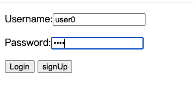
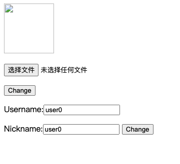
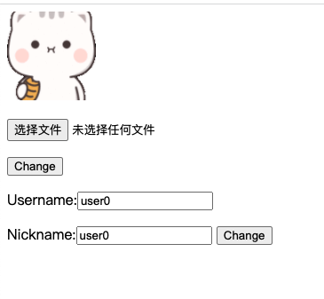
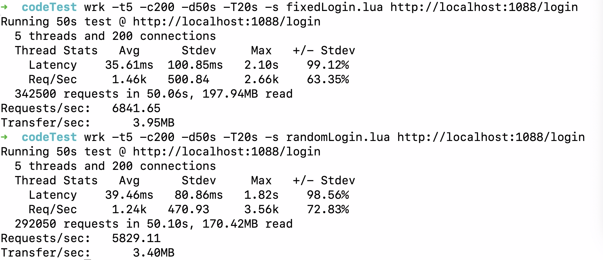
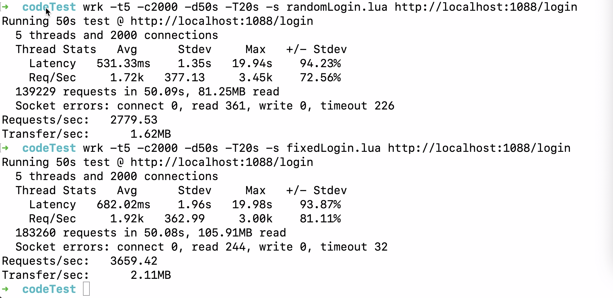

# 用户管理系统

## 设计简介

* 此项目主要包含三个部分

  * 用户 web 登陆界面
  * http server 服务
  * tcp server 服务

* **HTTP Server** 负责处理 HTTP 请求，对用户数据进行简单处理并转发至 TCP 服务。

* **TCP Server** 处理 HTTP 服务转发的请求并访问 MySQL 和 redis。

* http server 和 tcp server 之间的通信主要是通过 rpc 协议。

* **rpc** 通信协议实现。

  * rpc 客户端：通过 tcp 连接 rpc 服务器，发送不同的数据信息，从而调用不同的 rpc 服务。

  * rpc 服务端：首先注册一些服务(本质服务对应的服务处理函数)，监听请求。 当收到 rpc 客户端数据时，解析信息调用对应的服务并且将处理完成的结果返回给客户端。


## 实现流程

**整体流程图**

```flow
start=>start: start
web=>operation: web UI
http=>operation: http server
tcp=>operation: tcp server
mysql=>operation: read mySql
redis=>operation: read redis
hasCache=>condition: has cache?
saveCache=>operation: save cache
process=>operation: process data
end=>end: end
start->web->http->tcp->redis->hasCache
hasCache(no)->mysql->saveCache(left)->process
hasCache(yes)->process->end
```

## API 接口

### 1.注册

| URL     | 方法 |
| ------- | ---- |
| /signUp | POST |

**输入参数**

| 参数名   | 描述   |
| -------- | ------ |
| username | 用户名 |
| password | 密码   |

### 2.登录

| URL    | 方法 |
| ------ | ---- |
| /login | POST |

**输入参数**

| 参数名   | 描述   |
| -------- | ------ |
| username | 用户名 |
| password | 密码   |

### 3.获取用户信息

>需要在登录接口之后调用

| URL      | 方法 |
| -------- | ---- |
| /profile | GET  |

**输入参数**

| 参数名   | 描述   |
| -------- | ------ |
| username | 用户名 |

### 4.更改用户昵称

> 需要在登录接口之后调用

| URL             | 方法 |
| --------------- | ---- |
| /updateNickName | POST |

**输入参数**

| 参数名   | 描述   |
| -------- | ------ |
| username | 用户名 |
| nickname | 新昵称 |

### 5.更改用户头像

> 需要在登录接口之后调用

| URL               | 方法 |
| ----------------- | ---- |
| /uploadProfilePic | POST |

**输入参数**

| 参数名   | 描述         |
| -------- | ------------ |
| username | 用户名       |
| image    | 头像图片路径 |

## 数据储存

### mysql 设计

主要维护两张表，一张保存用户信息， 一张保存用户登陆信息。

#### 用户信息表(user_profile)

| Field     | Type         | Null | Key  | Default | Extra |
| --------- | ------------ | ---- | ---- | ------- | ----- |
| user_name | varchar(255) | NO   | PRI  | NULL    |       |
| nick_name | varchar(255) | YES  |      | NULL    |       |
| pic_name  | varchar(255) | YES  |      | NULL    |       |

#### 用户登陆信息表(user)

| Field     | Type         | Null | Key  | Default | Extra |
| --------- | ------------ | ---- | ---- | ------- | ----- |
| user_name | varchar(255) | NO   | PRI  | NULL    |       |
| password  | char(32)     | NO   |      | NULL    |       |

### redis 设计

redis 缓存数据设计。主要是缓冲登陆校验的 token 、用户信息和登录信息。用户信息键值对中的值，是一个哈希表，表中分表是代表用户的的 nick_name，用户的pic_name。

| key           | value                           |
| ------------- | ------------------------------- |
| auth_username | token                           |
| username      | {[nick_name, “”] [pic_name,“”]} |
| username_pwd  | password                        |

## 代码结构

```bash
userSystem
├── config                  // 配置文件
├── httpServer              // http server
├── mysql                   // mysql
├── protocol                // 主要定义一些通讯的数据结构
├── resource                // 文档所需要资源
├── redis                   // redis 相关文件
├── rpc                     // rpc 实现
├── static                  // 用户头像存放路径
├── tcpServer               // tcp server
├── templates               // 用户 UI 相关 html
└── utils                   // 工具函数
```

## 部署

1. 运行 TCP server

```bash
go run tcpServer.go
```

2. 运行 HTTP server

```bash
go run httpServer.go
```

## 测试

### 功能测试

**用户登陆**



**显示用户信息**

> 默认用户图像信息为空



**修改用户头像**



### 单元测试

简单对 redis,mysql,tcpServer 接口进行单元测试.

分别在 **redis, mysql, tcpServer**，目录下执行

```bash
go test
```

主要执行 **redis/redis_test.go**，**mysql/mysql_test.go**,**tcpServer/tcpServer_test.go** 测试文件.

### 压力测试

使用 wrk 和 lua 脚本分别进行压力测试。

对 login 进行压力测试

在 wrk 目录下执行

```bash
wrk -t5 -c200 -d50s -T20s -s fixedLogin.lua http://localhost:1088/login
```

- 200 固定用户登录、随机用户登录



- 2000 固定用户登录、随机用户登录



## 问题总结

刚开始写的 rpc 客户端是异步请求客户端（一个客户端，可以发送多个异步请求。一次请求创建/关闭一次连接）。这样子做性能压测上不去。解决办法：增加 mysql 的最大连接数。修改为 rpc 客户端连接池（复用 mysql 连接）。

## 编码规范
1、尽量不要用魔数
2、一个函数尽量只做一件事情
3、函数长度不要太长
4、使用 gofmt
5、统一的代码提交模板
6、结构体、接口注释
7、一行代码不能太长
8、不用 goto
9、合理使用 return
```go
if xxx {
  if aaa {
    handle(...)
  }
}

// 修改为
if !xxx {
  return
}
if !aaa {
  return
}
handle(...)

```